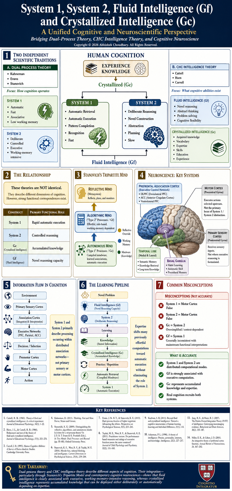

# System 1, System 2, Fluid Intelligence (Gf) and Crystallized Intelligence (Gc)

## A Unified Cognitive and Neuroscientific Perspective

Bridging Dual-Process Theory, CHC Intelligence Theory, and Cognitive Neuroscience

---

---

Copyright © 2026 Abhishek Choudhary.

All Rights Reserved.

